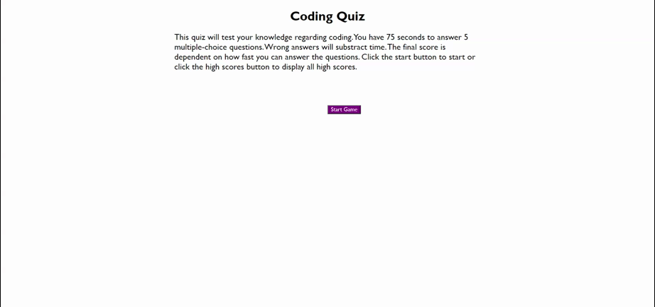

# CodingBasicsQuiz
## Project Summary
This project will be a web app that conducts a quiz for the user. It asks several multiple choice questions on a timer. Answer incorrectly and it subtracts time. Final score is determined by time left. High scores are recorded and displayed for future users. 

## Project Process
I began by working on a framework for html and setting up the question, answer, result areas. I reference them in the javascript and continue to use them to change the contents and styles. The first piece of the puzzle was the timer. I used a similar timer from one of our classes and modified it to display the number of seconds I wanted.

Next, I worked on the question and answer modules. The quiz needed to display questions and a set of answers per question. I created separate variables for each question and answer set. These were referenced per question and displayed.

``Event listeners were used throughout this project to detect button clicks and user form submittals.``

I did my best to create questions that would be used in an actual coding Quiz. Once I was able to display the questions and list of answers. I then tied each question together in sequential order (Question 1 to 5). The wrong answer will subtract an amount at the end of the function, reducing the score of the quiz taker.

When all the questions are answered or the timer runs out, the quiz is complete. The user is presented with a box to type in their name so that it can be saved as part of the HIGH SCORES list. The high scores list is displayed after the user hits enter on their name. The user can see all the scores currently saved to local storage. There is an option to clear them or a button to retry the quiz. Since the scores are stored in local storage, it can be seen again even when the page is closed and reloaded/reopened.

## Project Link
https://pricosaint.github.io/CodingBasicsQuiz/

## Project Screenshot

